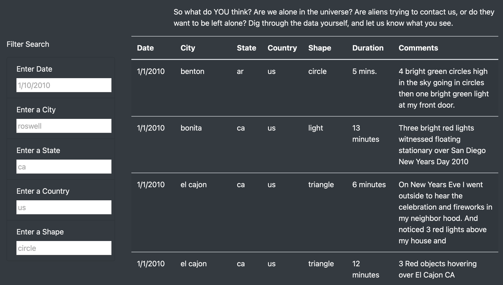
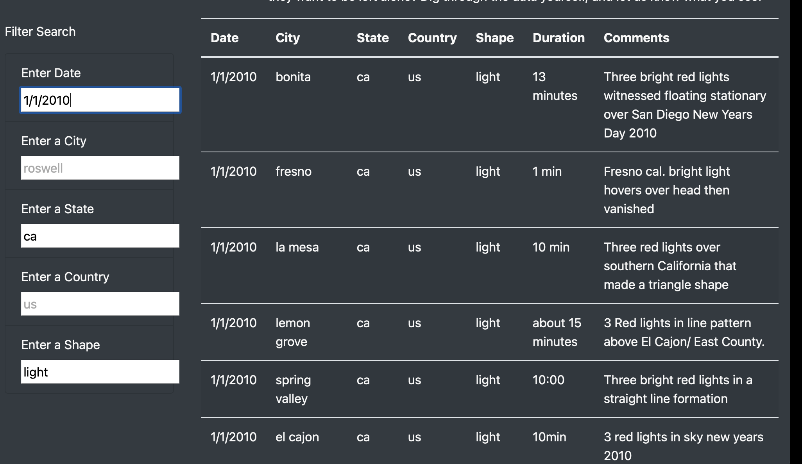

# UFOs
# **Project Overview**
The purpose of this assignment was to document and analyze UFO sightings by building a table using data stored in a JavaScript array and displaying it on an interactive website. 

### **Challenge Goal**
With the functioning table and “date filter” created earlier, add the following:
- Filter UFO sightings on multiple criteria
- A written report on the UFO analysis

### **Resources**
- Resources: data.js
- Software: Visual Studio Code, JavaScript, CSS, HTML, BootStrap, DevTools

## **Results**
The table was created using data stored in a JavaScript array. Filters were added to make it fully dynamic, meaning that it would react to user input. The table was placed into an HTML file for easy viewing. The webpage was customized using Bootstrap and a Style.css page. The table was given functional filters that allow users to interact with the data starting with the date. Then additional filters were added to drill down into the data further. See image below.

The result was an interactive experience for users to narrow their search criteria and give users the ability to find what they are looking for among the vast amount of UFO sightings. The user would open the index.html file that contains the website. The user would navigate to the “Filter Search” bar on the left hand side of the screen. Then depending on whether the user knew what they were searching for or not, they would filter the data. In the example below, the date of 1/1/2010 was chosen for the state of California with an object shape of “light”. The page automatically updates the search results to this criteria. A pattern can be seen in the resulting data that three red lights were seen across California and may be related. The results can be further narrowed down to show only a certain city.

## **Summary**
While adding additional filters besides “date” allows the user to further analyze the data, there is an obvious drawback to the new design. Once filters have been added, the user needs to either refresh the page or delete all the filters to return to the original page. Below the last filter, I would recommend adding a button that clears out all the filters and returns the page back to its original state.

To further improve the functionality of the website, additional enhancements could be made:

The first improvement would be to the filters. It would be convenient for the filters to save previous search history so that the user could auto populate a previous search. It is especially useful for situations where the user is frequenting that data often but not within the same time setting. This would be done by adding a saved searches feature that the user could select. 
The second improvement to the site would be to assist the user in filtering the webpage with available data. Currently the search cells do not auto populate with available search criteria when the user starts typing. I think it would be helpful to add a feature that does this to help the user realize what options are available to be searched. The idea is similar to a drop down menu. For example, If you typed in the letter “L” in the city filter, below the filter would give the options of “La Mesa, Lemon Grove, Loveland, London. This would let the user know these are the only city options that start with the letter L. As the user types the next letter, say “O”, the drop down would shrink to just Loveland or London. The user could click one of those options to auto populate the search, in turn helping them work through the data faster.
